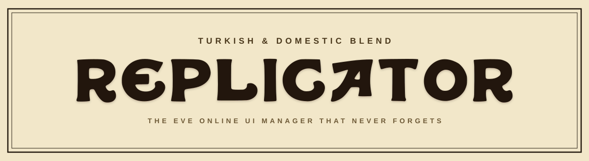

<p align="center">
  
</p>

<p align="center">
  <a href="https://replicator.rip">replicator.rip</a> ·
  <a href="https://replicator.rip/docs">Docs</a> ·
  <a href="https://discord.gg/N82KJcS47f">Discord</a>
</p>

Replicator copies EVE Online UI settings between characters. It runs on
Windows, macOS, and Linux.

## Features

- Copies a character's UI settings to any number of other characters, or to
  a saved group, across every profile and server they appear in. Copies can
  also be limited to individual settings groups: windows, overview,
  shortcuts, chat channels, and so on.
- A WYSIWYG layout designer. It draws a character's window layout to scale;
  windows can be dragged and resized, and the result written back to the
  character or saved as a template. Minimum window sizes match what the EVE
  client actually enforces.
- Templates freeze a full setup and can be applied later, including to
  characters created after the template was saved.
- Every change is committed to a local git repository. Any version can be
  restored, in full or one settings group at a time, and history entries
  show which settings groups changed.
- The repository can be pushed to a private GitHub remote and cloned back
  on another machine. The access token is stored in the OS keyring.
- Whole setups can be exported to and imported from zip archives with
  checksummed manifests.
- The accounts view maps characters to their accounts, with aliases and
  notes. The mapping is learned from the launcher's logs, or set by hand
  when the logs are wrong.
- EVE installs are detected automatically, including Steam, Proton, and
  Flatpak.
- The UI is translated into eight languages.
- There is no account and no telemetry. The network calls are to EVE's
  public ESI and image servers (character names and portraits), to GitHub's
  releases API once per launch to check for a newer version, and to any git
  remote you configure.
- All writes are blocked while an EVE client or launcher is running,
  because EVE rewrites its settings files on exit.

## Download

Installers are on the
[releases page](https://github.com/isomerc/replicator/releases/latest):
a `-setup.exe` for Windows, `.dmg` for macOS, `.AppImage` / `.deb` /
`.rpm` for Linux. The builds are unsigned, so macOS and Windows warn on
first launch - the [install notes](https://replicator.rip/docs/installation)
cover it. Once installed, the app offers in-place updates when a new
release is out (except on `.deb` / `.rpm` installs, where it links to
this page instead).

## Building from source

You need a Rust toolchain, Node 22+, and pnpm. On Linux you also need the
webkit2gtk 4.1, GTK 3, and ALSA development headers. The repository ships a
Nix flake that provides all of it.

```bash
git clone https://github.com/isomerc/replicator
cd replicator

# with nix + direnv (otherwise install the toolchains yourself)
direnv allow

pnpm install
pnpm tauri build --config src-tauri/tauri.local.json
```

The `--config` flag turns off updater-artifact signing, which needs the
release key that only CI has; without it the build errors after bundling.
Bundles land in `src-tauri/target/release/bundle/`. On NixOS the AppImage
bundler needs an FHS environment it will not find; add
`--bundles deb,rpm` and let CI produce the AppImage.

## Development

```bash
pnpm tauri dev        # run against the Vite dev server
```

The Rust tests compile against the built frontend
(`tauri::generate_context!` embeds `dist/` at compile time), so build it once
first:

```bash
pnpm build
cd src-tauri
cargo test --lib
```

`scripts/coverage.sh` runs the suite under `cargo-llvm-cov` and prints a
per-file summary.

## License

The code is [MIT](LICENSE). The mascot artwork and the wordmark
lettering are not: they are the Joe Camel character and a typeface that
imitates the Camel logo, neither of which this project owns, and the
LICENSE file carves them out. The other typefaces are under the SIL Open
Font License; see `public/fonts/OFL.txt`.
